# Subscription Management System API (Backend-Project)

A production-ready Subscription Management System built with Node.js and Express, designed to handle real users, real payments, and real-world business logic.

## 📋 <a name="table">Table of Contents</a>

1. 🤖 [Introduction](#-introduction)
2. ⚙️ [TechStack](#-techstack)
3. 🔋 [Features](#-features)
4. 🤸 [Quick Start](#-quick_start)
5. 🚀 [Testing](#-testing)

## 🤖 Introduction

Build a **production-ready Subscription Management System API** that handles **real users, real money, and real business logic**.

Authenticate users using JWTs, connect a database, create models and schemas, and integrate it with ORMs. Structure the architecture of your API to ensure scalability and seamless communication with the frontend.

If you're getting started and need assistance or face any bugs, join our active Discord community with over **50k+** members. It's a place where people help each other out.

## ⚙️ TechStack

- Node.js
- Express.js
- MongoDB

## 🔋 Features

👉 **Advanced Rate Limiting and Bot Protection**: with Arcjet that helps you secure the whole app.

👉 **Database Modeling**: Models and relationships using MongoDB & Mongoose.

👉 **JWT Authentication**: User CRUD operations and subscription management.

👉 **Global Error Handling**: Input validation and middleware integration.

👉 **Logging Mechanisms**: For better debugging and monitoring.

👉 **Email Reminders**: Automating smart email reminders with workflows using Upstash.

and many more, including code architecture and reusability

## 🤸 Quick_Start

Follow these steps to set up the project locally on your machine.

**Prerequisites**

Make sure you have the following installed on your machine:

- [Git](https://git-scm.com/)
- [Node.js](https://nodejs.org/en)
- [npm](https://www.npmjs.com/) (Node Package Manager)

**Cloning the Repository**

```bash
git clone https://github.com/imashaRan12/production-ready-api-backend-project.git
cd production-ready-api-backend-project
```

**Installation**

Install the project dependencies using npm:

```bash
npm install
```

**Set Up Environment Variables**

Create a new file named `.env.local` in the root of your project and add the following content:

```env
# PORT
PORT=5500
SERVER_URL="http://localhost:5500"

# ENVIRONMENT
NODE_ENV=development

# DATABASE
DB_URI=

# JWT AUTH
JWT_SECRET=
JWT_EXPIRES_IN="1d"

# ARCJET
ARCJET_KEY=
ARCJET_ENV="development"

# UPSTASH
QSTASH_URL=http://127.0.0.1:8080
QSTASH_TOKEN=

# NODEMAILER
EMAIL_PASSWORD=
```

**Running the Project**

```bash
npm run dev
```

Open [http://localhost:5500](http://localhost:5500) in your browser or any HTTP client to test the project.

## 🚀 Testing

All the testing are done by using [HTTPie](https://httpie.io/) api testing app and capture these:

1. Sign Up

   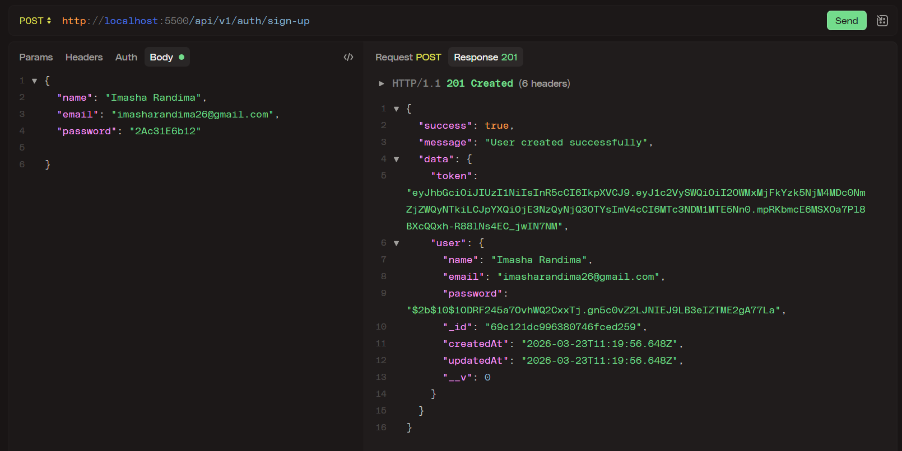

   Created in MongoDB cluster

   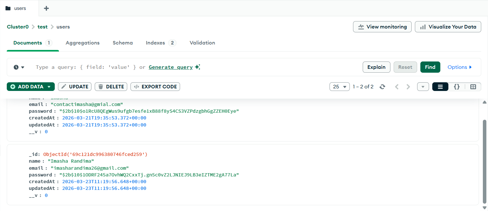

2. Sign In

   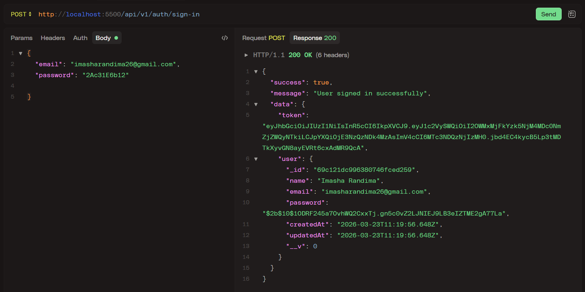

3. Unauthorized Access (Try accessing protected route without token)

   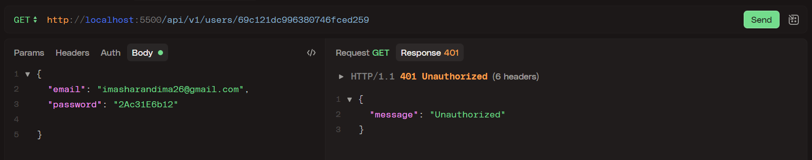

4. Get Single User (User can see only their details)

   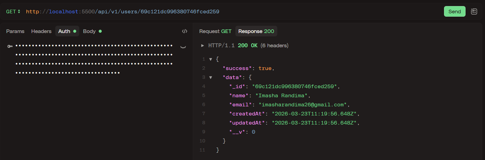

5. Update User Details

   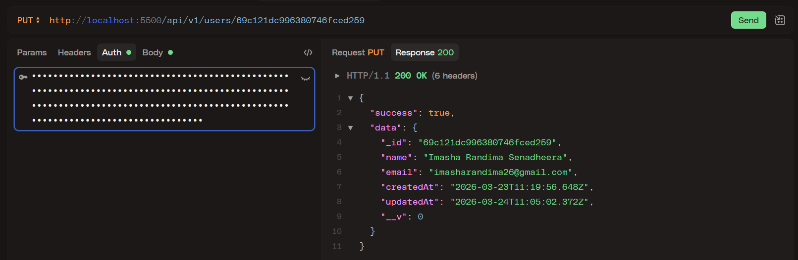

   Update in Mongodb user document

   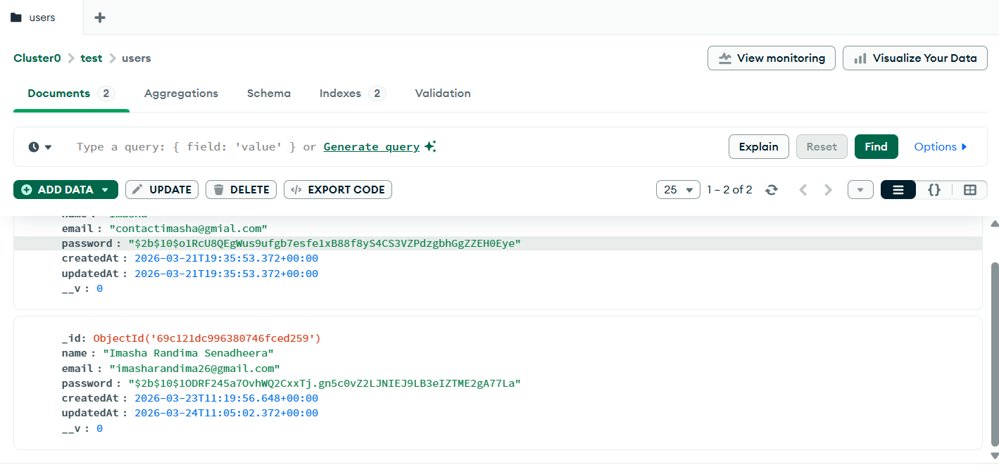

6. Delete User

   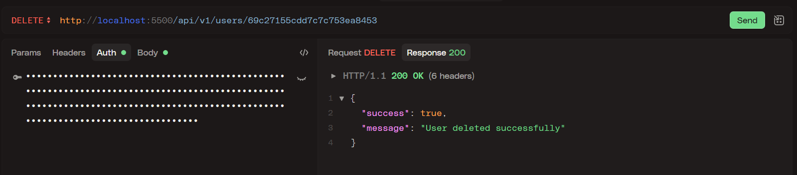

7. Create Subscription

   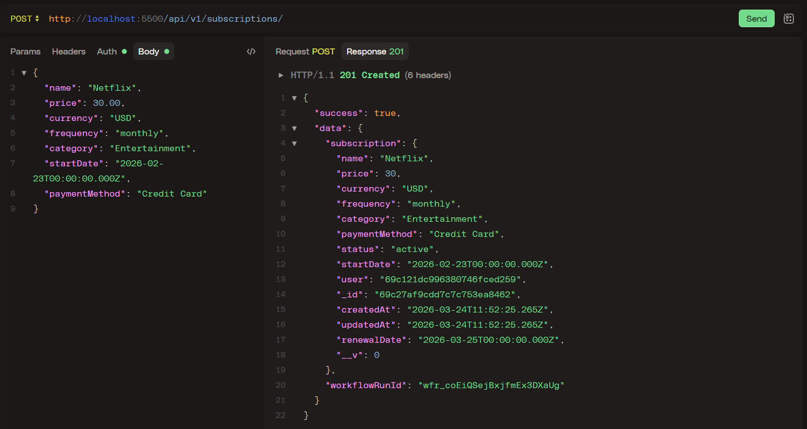

8. Send Email Reminder for Renewal Subscription

   Console Message:

   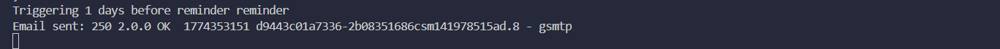

   Receive the Email to User:

   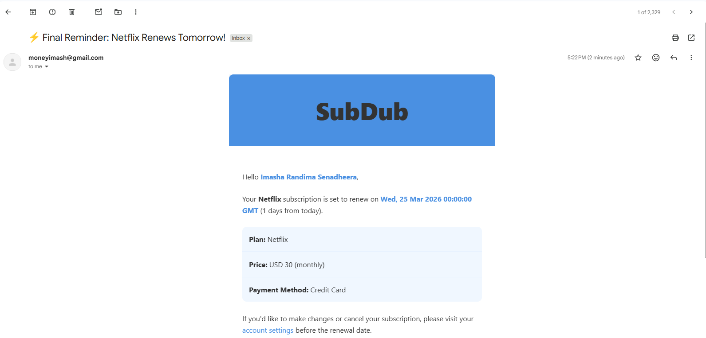
   

9. Get User Subscriptions

   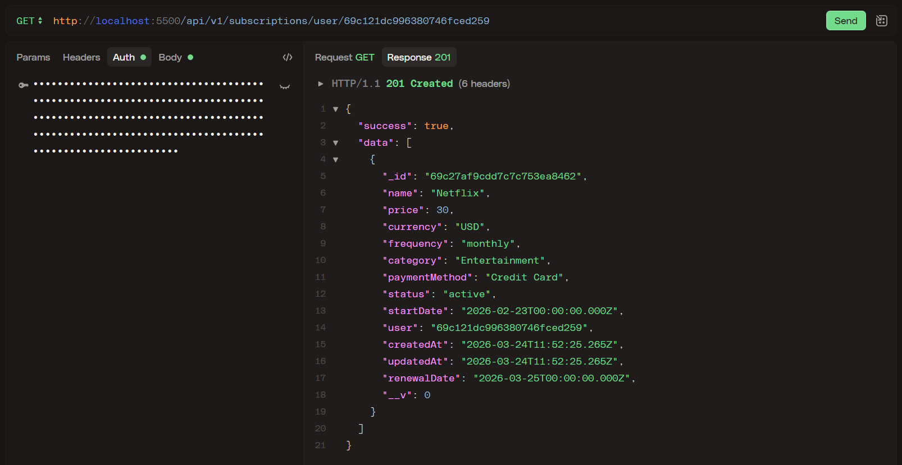

10. Rate limiting enabled

    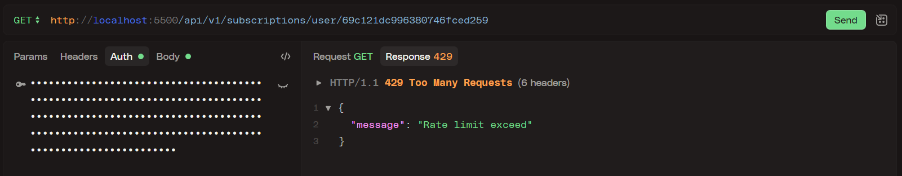
